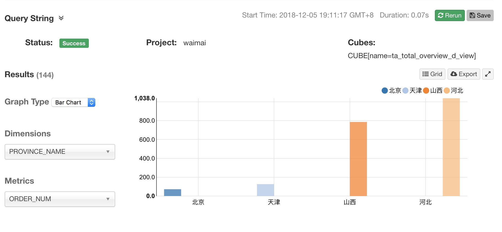
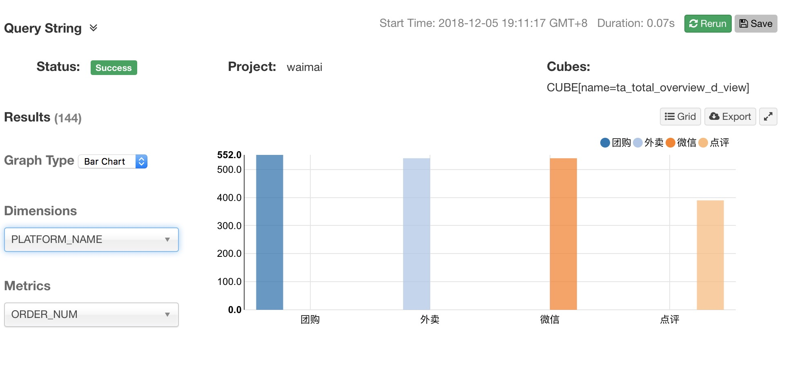

> 网易Spark大数据开发工程师微专业实战大项目 
> 基于Spark的外卖大数据平台分析系统

说明
>可将你的hive-site.xml文件放到resources下，
Spark应用程序在IDEA里面运行的时候，会读取这个Hive的配置文件，加载相应的Hive配置信息

 > 运行顺序**td**→**ti**→**tf**→**tm**→**ta**
 

### package说明
1. ta为应用层 
    * 可直接运行生成对应的表
2. td为维度层
    * 可直接运行生成对应的表
3. tf为整合层
    * 可直接运行生成对应的表
4. tm为中间层
    * 可直接运行生成对应的表
5. ti为接口层
    * 可直接运行生成对应的表
    
    
后续可用Apache Kylin，来提高SQL执行的效率 
下面展示一些Kylin的WebUI的可视化效果

图1

图2

图3